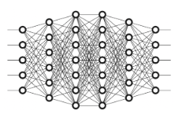

## Quiz for first syllabus

#### Q1. Di bawah ini, manakah pernyataan yang tepat terkait Deep Learning dengan Machine Learning?

- \[ ] Tidak semuanya
- \[x] Deep Learning merupakan sub-cabang dari machine learning
- \[ ] Deep Learning dan machine learning merupakan hal yang sama
- \[ ] Deep Learning dan machine learning merupakan cabang ilmu yang tidak berhubungan sama sekali
- \[ ] Machine Learning merupakan sub-cabang dari deep learning

#### Q2. Di bawah ini yang merupakan contoh layer dalam struktur ANN yaitu, kecuali...

- \[ ] Tidak semuanya
- \[ ] Input Layer
- \[ ] Output Layer
- \[ ] Hidden Layer
- \[x] Function Layer

#### Q3. Urutan yang tepat dalam membuat model deep learning adalah...

- \[x] Deklarasi - compile - training
- \[ ] Compile - training - deklarasi
- \[ ] Deklarasi - training - compile
- \[ ] Compile - deklarasi - training
- \[ ] Training - compile - deklarasi

#### Q4. Pada kode dibawah ini, berapakah jumlah node pada input layernya? <br>

```
model = keras.models.Sequentials([
    keras.layers.Dense(16, activation=\"relu\", input_dim = 4),
    keras.layers.Dense(16,activation=\"relu\"),
    keras.layers.Dense(3, activation=\"softmax\"),
])
```

- \[ ] 16
- \[ ] 2
- \[x] 4
- \[ ] 20
- \[ ] 3

#### Q5. Mengapa kita perlu mengubah data yang masih dalam bentuk string atau object kedalam bentuk numerik dalam proses pembuatan model deep learning?

- \[x] Karena model deep learning membutuhkan semua data input dan output nya dalam bentuk numerik
- \[ ] Tidak semuanya
- \[ ] Karena model deep learning hanya membutuhkan data output dalam bentuk numerik
- \[ ] Agar terlihat keren
- \[ ] Karena model deep learning hanya membutuhkan data input dalam bentuk numerik

#### Q6 Berapa banyak jumlah hidden layer dari Arsitektur Neural Network <br>  <br>

- \[ ] 7
- \[ ] 3
- \[ ] 2
- \[ ] 5
- \[x] 4

#### Q7 Berapa jumlah neuron pada input layer dari Arsitektural Neural Network dibawah ini? <br>  <br>

- \[ ] 6
- \[ ] 3
- \[ ] 4
- \[ ] 7
- \[x] 5

#### Q8 Berapa jumlah neuron pada output layer dari Arsitektural Neural Network dibawah ini? <br>  <br>

- \[ ] 7
- \[ ] 6
- \[x] 5
- \[ ] 3
- \[ ] 4

#### Q9. Kode `.summary()` dari model yang telah dideklarasi akan memberikan informasi terkait, kecuali

- \[ ] Tipe Layer
- \[ ] Jumlah parameter
- \[x] Akurasi
- \[ ] Jumlah parameter yang dapat di train
- \[ ] Output shape

#### Q10. Pada lapisan ... neuronnya tidak memiliki activation function

- \[ ] Freeze Layer
- \[ ] Output Layer
- \[x] Input Layer
- \[ ] Function Layer
- \[ ] Hidden Layer
