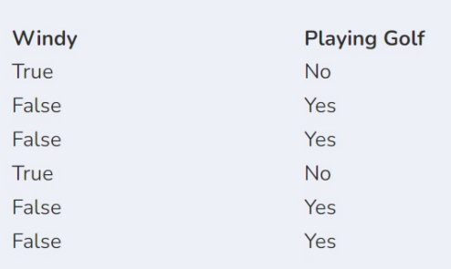

## Post test Questions and Answers from DataScience Class

#### Q1. Predicting the price of a house to a certain value is one example of the case ...

- \[x] Regression
- \[ ] Data Merge
- \[ ] Association
- \[ ] Classification
- \[ ] Databases

#### Q2. The steps taken after modeling (building a model) is ...

- \[ ] Data collection
- \[x] Model evaluation
- \[ ] Data validation
- \[ ] Model deployment
- \[ ] Data understanding

#### Q3. The proper flow in the data science methodology are ...

- \[ ] Data Collection - Modeling - Evaluation - Business Understanding
- \[ ] Data Collection - Modeling - Business Understanding - Evaluation
- \[x] Business Understanding - Data Collection - Modeling - Evaluation
- \[ ] Business Understanding - Evaluation - Data Collection - Modeling
- \[ ] Modeling - Evaluation - Data Collection - Business Understanding

#### Q4. The following are the fundamental knowledge that a Data Scientist mus possess are as follows, except ...

- \[x] Language literature
- \[ ] Math
- \[ ] Domain/Business Knowledge
- \[ ] Computer Science
- \[ ] Statistics

#### Q5. What do data scientist typically use for exploratory analysis of data and to get acquinted with it?

- \[ ] Use SVM or Neural Network as feature extraction
- \[ ] Use text summarization method
- \[ ] Use self-learning
- \[x] Use descriptive statistics and data visualization techniques
- \[ ] Use deep learning

#### Q6. Modul apakah yang perlu kita import untuk menangani perhitungan tanggal dan waktu menggunakan Python?

- \[x] datetime
- \[ ] timedate
- \[ ] time
- \[ ] timescount
- \[ ] date

#### Q7. Ketika melewati sebuah fungsi, \*args akan disimpan pada datatype ...

- \[ ] dictionary
- \[x] tuple
- \[ ] tensor
- \[ ] list
- \[ ] semua benar

#### Q8. Berikut ini yang merupakan statement untuk Exception Handling adalah ...

- \[ ] except
- \[x] Semua benar
- \[ ] try
- \[ ] raise
- \[ ] finally

#### Q9. Manakah dari fungsi berikut pada Python yang mengubah tanggal menjadi waktu yang sesuai?

- \[ ] semua benar
- \[ ] strftime()
- \[x] strptime()
- \[ ] to_time()
- \[ ] semua salah

#### Q10. Ketika melewati sebuah fungsi, \*\*kwargs akan disimpan pada datatype ...

- \[ ] tensor
- \[ ] list
- \[ ] tuple
- \[ ] semua benar
- \[x] dictionary

#### Q11. Untuk melihat proporsi suatu kelas di dalam data yang kita analisis, dapat dilakukan dengan memvisualisasikannya ke dalam ...

- \[ ] Line chart
- \[x] Pie chart
- \[ ] Matrix faktorisasi
- \[ ] Table excel
- \[ ] Numpy array

#### Q12. Berikut ini yang bukan merupakan manfaat Exploratory Data Analysis yang dilakukan sebelum memodelkan data adalah ...

- \[ ] Menyiapkan data berdasarkan kondisi dan karakteristiknya
- \[ ] Mengenali karakteristik data
- \[ ] Menggali insight data
- \[ ] Memahami korelasi dan pola yang ada pada data
- \[x] Memastikan nilai akurasi

#### Q13. Dalam EDA, proses melakukan analisis yang menggunakan lebih dari atau sama dengan tiga variabel disebut dengan ...

- \[ ] Univariate analysis
- \[ ] Dimensional analysis
- \[ ] Factor analysis
- \[x] Multivariate analysis
- \[ ] Bivariate analysis

#### Q14. Ada atau tidaknya hubungan antara dua variabel dapat kita lihat pada nilai ...

- \[ ] Akurasi
- \[ ] Mean
- \[ ] Identifikasi
- \[ ] Median
- \[x] Korelasi

#### Q15. Dalam EDA, proses melakukan analisis relasi dengan dua variabel yang biasanya dengan target variabel disebut juga dengan ...

- \[x] Bivariate analysis
- \[ ] Multivariate analysis
- \[ ] Univariate analysis
- \[ ] Factor analysis
- \[ ] Dimensional analysis

#### Q16. Berikut ini yang bukan termasuk proses yang biasanya ada di dalam preprocessing adalah ...

- \[x] Evaluasi performa model
- \[ ] Handling outliers
- \[ ] Hapus duplikat data
- \[ ] Handling missing value
- \[ ] Transformasi data

#### Q17. Pada kasus imbalanced data, metric evaluasi yang dilihat hanyalah metric akurasi

- \[ ] True
- \[x] False

#### Q18. Berikut ini yang merupakan salah satu bentuk teknik feature extraction pada data audio adalah ...

- \[x] Spectogram
- \[ ] Morphological Transformation
- \[ ] Case Folding
- \[ ] Geometric Transformations
- \[ ] TF-IDF

#### Q19. Teknik pengolahan gambar untuk mengatur dan merubah jenis channel dikenal juga dengan teknik ...

- \[ ] Resize image
- \[x] Changing color space
- \[ ] Morphological Transformation
- \[ ] Stopword removal
- \[ ] Croping

#### Q20. Preprocessing teks untuk men-generalisir bentuk tulisan ke dalam huruf kecil atau besar disebut juga dengan ...

- \[ ] slang word handling
- \[ ] bag of words
- \[ ] stopword removal
- \[x] case folding
- \[ ] feature scaling

#### Q21. Dalam melakukan visualisasi atau membangun dashboard tidak diwajibkan menggunakan semua jenis grafik yang tersedia.

- \[x] True
- \[ ] False

#### Q22. Visualisasi yang bagus dapat mempersulit user mencerna informasi dan berpotensi terjadi salah pemahaman (missunderstanding) pada hasil analisa data

- \[ ] True
- \[x] False

#### Q23. Untuk visualisasi atribut yang berisi nilai longitude dan latitude dapat menggunakan grafik ...

- \[ ] Histogram
- \[ ] Boxplot
- \[x] Geomap
- \[ ] Bar chart
- \[ ] Line chart

#### Q24. Untuk melihat relasi dan sebaran dari dua buah variabel lebih cocok menggunakan scatter plot.

- \[x] True
- \[ ] False

#### Q25. Grafik yang cocok untuk visualisasi data yang bersifat time series adalah ...

- \[ ] Pie chart
- \[x] Line chart
- \[ ] Subplot
- \[ ] Box plot
- \[ ] Histogram

#### Q26. Berikut pernyataan yang benar untuk algoritma KNN adalah ...

- \[ ] KNN menggunakan hyperplane untuk melakukan klasifikasi.
- \[ ] KNN merupakan algoritma Machine Learning yang tidak menunjang untuk classification task.
- \[x] KNN percaya suatu data dapat diklasifikasikan menurut mayoritas kelas/label dari k tetangga terdekatnya.
- \[ ] KNN menggunakan entropy untuk melakukan klasifikasi
- \[ ] KNN melakukan klasifikasi dengan melakukan break down pada permasalahan data untuk mendapatkan struktur klasifikasi.

#### Q27. Entropi merupakan suatu perhitungan untuk mengukur impurity atau uncertainty dari kelompok data observasi.

- \[x] True
- \[ ] False

#### Q28. Algoritma SVM tidak dibutuhkan hyperplane.

- \[ ] True
- \[x] False

#### Q29. Perhatikan tabel berikut:      Tentukan Entropy dari windy pada tabel tersebut!

- \[ ] 0,1
- \[x] 0
- \[ ] 0,2
- \[ ] 0,25
- \[ ] 0,5

#### Q30. Berikut ini yang bukan algoritma Machine Learning untuk kasus klasifikasi adalah ...

- \[x] Kmeans
- \[ ] SVM
- \[ ] KNN
- \[ ] Decision Tree
- \[ ] Naive Bayes

#### Q31. Berikut contoh penerapan regresi adalah ...

- \[ ] Sentiment analysis data teks.
- \[ ] Deteksi penyakit pada citra medis.
- \[x] Estimasi harga saham di masa depan.
- \[ ] Topic modelling dari dokumen.
- \[ ] Segmentasi sel kanker pada citra MRI otak.

#### Q32. Dalam algoritma Decission Tree yang dipakai untuk kasus regresi, output pada setiap ujung cabang diperoleh dengan menghitung nilai rata-rata dari subdata tersebut.

- \[x] True
- \[ ] False

#### Q33. Berikut contoh algoritma yang tidak cocok digunakan dalam kasus regresi adalah ...

- \[ ] Multiple Linear Regression
- \[ ] Decision Tree
- \[x] K-Means
- \[ ] Linear Regression
- \[ ] Support Vector Machine

#### Q34. Berikut library yang menyediakan algoritma regresi siap pakai adalah ...

- \[ ] opencv
- \[ ] pandas
- \[ ] plotly
- \[x] scikit-learn
- \[ ] matplotlib

#### Q35. Support Vector Machine dapat diarahkan untuk kasus Klasifikasi, juga dapat digunakan dalam kasus Regresi.

- \[x] True
- \[ ] False
