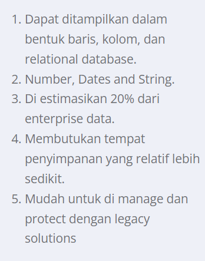

## Mid Semester Questions and Answers from Machine Learning Class

#### Q1. Hubungan antara information, data, wisdom, knowledge digambarkan dalam bentuk pyramid. Di bawah ini manakah urutan yang benar jika di urutkan dari bawah sampai puncak pyramid....

- \[x] data->information->knowledge->wisdom
- \[ ] information->data->knowledge->wisdom
- \[ ] data->knowledge->information->wisdom
- \[ ] wisdom->knowledge->information->data
- \[ ] data->information->wisdom->knowledge

#### Q2. Dalam proses machine learning, programmer akan memberikan instruksi kepada komputer untuk belajar dari contoh yang diberikan untuk memecahkan suatu permasalahan, programmer tidak menuliskan aturan-aturan bagaimana cara menyelesaikan suatu permasalahan secara eksplisit.

- \[x] True
- \[ ] False

#### Q3. Berikut ini merupakan cara untuk mengatasi dataset yang besar di dalam machine learning, kecuali....

- \[ ] Use a more efficient data format
- \[ ] Use a different system with more memory and processing power
- \[ ] Work with less data when possible
- \[ ] Reconfigure your system memory
- \[x] Load all data at one time

#### Q4. Dalam proses pembuatan machine learning model ada beberapa proses (tasks) yang harus kita lakukan, kecuali....

- \[ ] Clean and prepare the data
- \[x] Writing explicit rules for how to solve a given problem
- \[ ] Select, train and tune the model
- \[ ] Formulate the problem
- \[ ] Collect the dataset

#### Q5. Dalam memformulasikan masalah, pada tahapan frame the problem kita menulis deskripsi dari sebuah permasalahan. Penulisan dilakukan secara jelas mengenai rencana kita untuk diserahkan kepada seseorang yang akan melakukan development nantinya. Dalam prosesnya pada tahapan ini ada 3 pola yang dapat kita ikuti, yaitu Task(T), Experience (E) dan Performance(P). Pasangkanlah penjelasan yang tepat.

- \[x] E: What dataset the algorithm uses to learn - for example, "Records of real estate transactions ..."
- \[x] P: How you will evaluate the performance of the model. How you measures this depends on the type of task the algorithms performs
- \[x] T: What the algorithm should accomplish - for example, "Predict the sale price for house."

#### Q6. Dalam proses pembuatan machine learning model ada beberapa proses (tasks) yang harus kita lakukan, kecuali....

- \[ ] Utilization
- \[ ] Benefits
- \[ ] Rational
- \[x] Assumptions
- \[ ] Lifetime

#### Q7.1. Analyst menentukan tipe dari task yang dibutuhkan untuk digunakan (contohnya memprediksi harga berdasarkan trends saat ini), lalu analyst meng-assemles sebuah contoh dataset dan memperhatikan tipe dari learning algorithm yang akan digunakan untuk dataset yang ada.

- \[x] Machine Learning Scenario
- \[ ] Tidak ada jawaban
- \[ ] Traditional Programming

#### Q7.2. Analyst mengkaji masalah, menulis kesimpula tentang bagaimana masalah tersebut diselesaikan, dan membuat sebuah algoritma yang secara spesifik dituls untuk memecahkan masalah tersebut.

- \[ ] Machine Learning Scenario
- \[ ] Tidak ada jawaban
- \[x] Traditional Programming

#### Q8. 

- \[x] A: The Traditional Programming Paradigm
- \[x] B: Machine Learning

#### Q9. Berikut ini yang merupakan Supervised Learning adalah....

- \[ ] Self Organizing-Maps
- \[ ] K-Means
- \[ ] DBSCAN
- \[x] Support Vector Machine (SVM)
- \[ ] Mean Shift

#### Q10. Berikut ini yang merupakan metode Unsupervised Learning adalah....

- \[ ] Support Vector Machine, DBSCAN, K-Nearest Neighbor
- \[ ] Support Vector Machine, Self-Organizing Maps, K-Nearest Neighbor
- \[x] K-Means, Self-Organizing Maps, DBSCAN
- \[ ] Support Vector Machine, Naive Bayes, K-Nearest Neighbor
- \[ ] K-Means, Self-Organizing Maps, Support Vector Machine

#### Q11.1. Tentukan Pasang dari penjelasan yang ada:     

- \[x] Unstructured Data
- \[ ] Structured Data

#### Q11.2. Tentukan Pasang dari penjelasan yang ada:     

- \[ ] Unstructured Data
- \[x] Structured Data

#### Q12. Yang merupakan fungsi pandas dataframe yang memberikan return value berupa jumlah baris dan kolom pada sebuah dataframe dan berapa banyak memori yg digunakan adalah....

- \[ ] pandas.option_context()
- \[ ] import pandas as pd
- \[ ] my_dataframe.head()
- \[ ] my_dataframe.describe()
- \[x] my_dataframe.info()

#### Q13. Berikut ini yang merupakan fungsi yang menampilkan output berupa tabel yang menampilkan 5 data teratas dari sebuah dataframe dengan setiap row memiliki nomor dan menampilkan label untuk setiap kolom, yaitu....

- \[ ] pandas.option_context()
- \[ ] import pandas as pd
- \[ ] my_dataframe.describe()
- \[ ] my_dataframe.info()
- \[x] my_dataframe.head()

#### Q14. Berikut ini yang merupakan fungsi yang menampilkan output berupa tabel yang menampilkan nilai statististik secara deskriptif dalam setiap kolom, mean, min, max, quarter dan standar deviasi, yaitu....

- \[ ] pandas.option_context()
- \[ ] import pandas as pd
- \[x] my_dataframe.describe()
- \[ ] my_dataframe.info()
- \[ ] my_dataframe.head()

#### Q15. Dalam proses machine learning kita terkadang mendapatkan data dimana data tersebut memiliki banyak features atau attributes sehingga banyak feature atau attribute yang terkadang hanya memiliki sedikit korelasi bahkan tidak memiliki korelasi dengan proses machine learning yang ingin kita lakukan (classification/clustering/regression). Terdapat teknik untuk mengurangi features yang ada, dimana teknik ini akan mengurangi features dan menghasilkan data baru yang sudah lebih kecil dimensinya. Data baru yang dihasilkan akan berbeda dengan data aslinya sehingga sulit untuk di pahami oleh proggramer ....

- \[ ] Cleaning
- \[x] Dimensionality Reduction
- \[ ] Feature Selection
- \[ ] Encoding
- \[ ] Missing Value

#### Q16. Dalam proses machine learning kita terkadang mendapatkan data dimana data tersebut memiliki banyak features atau attributes sehingga banyak feature atau attribute yang terkadang hanya memiliki sedikit korelasi bahkan tidak memiliki korelasi dengan proses machine learning yang ingin kita lakukan (classification/clustering/regression). Terdapat teknik untuk mengurangi features yang ada, dimana teknik ini akan mengurangi features dengan cara akan menghitung korelasi antara features atau attributes dengan target. Biasanya akan dilakukan perankingan terhadap setiap attribute yang ada dari attribute yang paling memiliki korelasi sampai attribute yang tidak terlalu memiliki korelasi dengan target....

- \[ ] Cleaning
- \[ ] Dimensionality Reduction
- \[x] Feature Selection
- \[ ] Encoding
- \[ ] Missing Value

#### Q17. Berikut ini beberapa teknik untuk mengisi missing value yang benar adalah ....

- \[ ] Mean Imputation, Substitution, Hot Deck Imputation, Tree dan Cold Deck Imputation
- \[ ] Mean Imputation, PCA, Hot Deck Imputation, Regression Imputation dan Cold Deck Imputation
- \[ ] Mean Imputation, SVM, Hot Deck Imputation, Regression Imputation dan Cold Deck Imputation
- \[ ] Mean Imputation, Substitution, PCA, Regression Imputation dan Cold Deck Imputation
- \[x] Mean Imputation, Substitution, Hot Deck Imputation, Regression Imputation dan Cold Deck Imputation

#### Q18. Dalam pra-proses data terdapat teknik dimana teknik terssebut digunakan untuk membuat range setiap attribute yang ada berada pada range yang sama. Teknik tersebut disebut....

- \[ ] Regression
- \[ ] Data Cleaning
- \[x] Normalization Data
- \[ ] Missing Value
- \[ ] Classification

#### Q19. Dalam scikit-learn library terdapat fungsi untuk memisahkan data menjadi data training dan data testing. Librari yang benar di bawah ini adalah....

- \[ ] sklearn.model_selection.split_test_train()
- \[x] sklearn.model_selection.train_test_split()
- \[ ] sklearn.model_selection.train_split()
- \[ ] sklearn.model_selection.test_split()
- \[ ] sklearn.model_selection.trainTestSplit()

#### Q20. Decision Tree merupakan salah satu metode klasifikasi dalam machine learning dimana dalam prosesnya akan membangun sebuah Tree berdasarkan perhitungan Gini Index. Benar atau Salah?

- \[x] True
- \[ ] False
