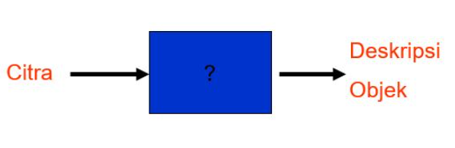

## Mid Semester Questions and Answers from Visual Recognition Class

#### Q1. Citra Digital adalah representasi citra melalui proses sampling berdasarkan ruang dan waktu

- \[x] True
- \[ ] False

#### Q2. Berikut ini merupakan contoh dari citra tampak, kecuali....

- \[x] Analog berupa sinyal video seperti gambar pada monitor televisi
- \[ ] Citra yang direpresentasikan menjadi fungsi matematik.
- \[ ] data gambar dalam file

#### Q3. Berikut ini merupakan contoh dari citra tak tampak, kecuali....

- \[ ] Optik berupa foto
- \[x] data gambar dalam file
- \[ ] Optik berupa foto, Analog berupa sinyal video seperti gambar pada monitor televisi

#### Q4. Setiap citra digital tersusun dari data....

- \[x] number
- \[ ] string
- \[ ] char

#### Q5. Setiap citra digital terdiri dari (....No.1....) yang terbagi menjadi (....No.2....) untuk gambar berwarna dan (....No.3....) untuk gambar gray.

- \[x] No.3? 1 Channel
- \[x] No.1? Pixel
- \[x] No.3? 3 Channel

#### Q6.1 Nilai pixel mendekati 0 pada gray image merepresentasikan warna ...

- \[x] Hitam
- \[ ] Putih

#### Q6.2 Nilai pixel mendekati 255 pada gray image merepresentasikan warna....

- \[ ] Hitam
- \[x] Putih

#### Q7 Berikut ini yang merupakan bidang komputer yang berkaitan langsung dengan data citra....

- \[ ] Grafika Komputer, Basis Data, dan Pengenalan Pola
- \[ ] Grafika Komputer, Pengolahan Citra, dan Sistem Informasi
- \[ ] Algoritma, Pengolahan Citra, dan Pengenalan Pola
- \[ ] Grafika Komputer, Pengolahan Citra, dan Rekayasa Perangkat Lunak
- \[x] Grafika Komputer, Pengolahan Citra, dan Pengenalan Pola

#### Q8.1 Bertujuan menghasilkan citra (lebih tepat disebut grafik atau picture) dengan prinsip-prinsip geometri seperti garis, lingkaran, dan sebagainya.

- \[x] Grafika Komputer
- \[ ] Pengolahan Citra
- \[ ] Pengenalan Pola

#### Q8.2 Bertujuan memperbaiki kualitas citra agar mudah diinterpretasi oleh manusia atau mesin (dalam hal ini komputer).

- \[ ] Grafika Komputer
- \[x] Pengolahan Citra
- \[ ] Pengenalan Pola

#### Q8.3 Mengelompokkan data numerik dan simbolik (termasuk citra) secara otomatis oleh mesin (dalam hal ini komputer).

- \[ ] Grafika Komputer
- \[ ] Pengolahan Citra
- \[x] Pengenalan Pola

#### Q9    Gambar di atas menunjukkan proses ...

- \[x] Grafika Komputer
- \[ ] Pengolahan Citra
- \[ ] Pengenalan Pola

#### Q10    Gambar di atas menunjukkan proses ...

- \[ ] Grafika Komputer
- \[ ] Pengolahan Citra
- \[x] Pengenalan Pola

#### Q11    Gambar di atas menunjukkan proses ...

- \[ ] Grafika Komputer
- \[x] Pengolahan Citra
- \[ ] Pengenalan Pola

#### Q12.1 Menugaskan Properti kepada Objek

- \[x] Description
- \[ ] 3D Inference
- \[ ] Interpreting Motion
- \[ ] Recognition
- \[ ] Object Detection

#### Q12.2 Menafsirkan adegan 3D dari 2D yang dilihat.

- \[ ] Description
- \[x] 3D Inference
- \[ ] Interpreting Motion
- \[ ] Recognition
- \[ ] Object Detection

#### Q12.3 Menafsirkan gerakan

- \[ ] Description
- \[ ] 3D Inference
- \[x] Interpreting Motion
- \[ ] Recognition
- \[ ] Object Detection

#### Q12.4 Menempatkan label pada objek.

- \[ ] Description
- \[ ] 3D Inference
- \[ ] Interpreting Motion
- \[x] Recognition
- \[ ] Object Detection

#### Q12.5 Untuk menentukan apakah sebuah objek ada pada scene dan batas-batasannya

- \[ ] Description
- \[ ] 3D Inference
- \[ ] Interpreting Motion
- \[ ] Recognition
- \[x] Object Detection

#### Q13 Citra dapat disusun dari nilai array. Nilai array di bawah ini akan menghasilkan warna...     

- \[ ] Blue
- \[ ] Green
- \[x] Black
- \[ ] Red
- \[ ] White

#### Q14 Citra dapat disusun dari nilai array. Nilai array di bawah ini akan menghasilkan warna...     

- \[ ] Blue
- \[ ] Green
- \[ ] Black
- \[ ] Red
- \[x] White

#### Q15.1 Untuk menyimpan gambar

- \[ ] plt.imshow()
- \[x] plt.imsave()
- \[ ] plt.imread()

#### Q15.2 Untuk menampilkan gambar

- \[x] plt.imshow()
- \[ ] plt.imsave()
- \[ ] plt.imread()

#### Q15.3 Untuk membaca data gambar

- \[ ] plt.imshow()
- \[ ] plt.imsave()
- \[x] plt.imread()

#### Q16 Library yang digunakan untuk pengolahan citra adalah....

- \[x] cv2
- \[ ] numpy
- \[ ] matplotlib
- \[ ] pandas
